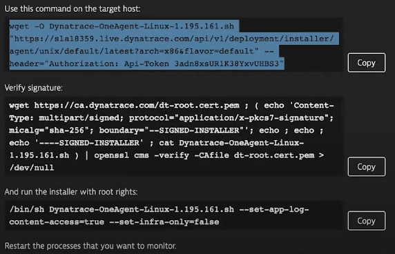

# AWS Cloud Computing

## Description
Project related to aws cloud computing bootcamp.

## Requirements
- [Terraform](https://www.terraform.io/downloads.html) 
- An account in AWS.
- [Docker](https://docs.docker.com/engine/install/)

## Terraform
In the folder to the repositorie we need to run the command:

``` ssh
terraform init
```
The above command will initialize the modules and the backend.

If this is the first time you are uploading the environment, it is important to run the command:

``` ssh
terraforming plan
```
It will show the execution plan with all the settings chosen in the ```main.tf``` file. So if all the settings are correct just run the command

 ``` ssh
terraform apply
 ```

If the environment is running on AWS and you want to see its settings, just run the command:

``` ssh
show terraform
```

## Inputs

|Name|Description|Type|Default|Optional|
|:-:|:-:|:-:|:-:|:-:|
|cdirs_remote_access|"List of CIDR blocks|string|--|No|
|region|Region of the instance|string|us-east-1|Yes|
|amis|AMI to use for the instance|map|ami-026c8acd92718196b|Yes|
|instance_type|Type of the instance|string|t2-micro|Yes|
|name_load_balancer|The name of the LB|string|--|No|
|name_target|The name of the target group|string|--|No|
|name_target_https|The name of the target group with protocol HTTPS|string|--|No|
|name_autoscaling|The name of the auto scaling|string|--|No|
|max_size|The maximum size of the Auto Scaling Group|number|--|No|
|min_size|The mainimum size of the Auto Scaling Group|number|--|No|
|path|Path in which to create the user|string|--|No|
|public_key|The public key material|string|--|No|

## Output

```
# IP list of instances
output "instance_ip" {
  value = [for instance in aws_instance.dev.*.public_i: {group = instance}]
}
```

## Configuring AWS CLI

For configure AWS CLI use the command bellow:

``` ssh
aws configure
```

In the command, you are to use the AWS access key, it was generated in this resource:

```
# IP list of instances
resource "aws_iam_access_key" "key" {
  user = aws_iam_user.user.name
}
```

## Installing Docker on VM

``` ssh
sudo apt-get update
sudo apt-get install \
    apt-transport-https \
    ca-certificates \
    curl \
    gnupg-agent \
    software-properties-common

$curl -fsSL https://download.docker.com/linux/ubuntu/gpg | sudo apt-key add -

$ sudo apt-key fingerprint 0EBFCD88

$sudo add-apt-repository \
   "deb [arch=amd64] https://download.docker.com/linux/ubuntu \
   $(lsb_release -cs) \
   stable"

$ sudo apt-get update

$ sudo apt-get install docker-ce docker-ce-cli containerd.io
```

## Creating an application Wordpress

For create an application Wordpress use the commands bellow on the VM:

``` ssh
export PASSWORD
docker pull mysql
docker pull wordpress
docker run --name data -e MYSQL_ROOT_PASSWORD=${PASSWORD} -d -p 3306:3306 mysql:latest
ip_instance=$(aws ec2 describe-instances --filters "Values=running" | jq -r ".Reservations[0].Instances[0].NetworkInterfaces[0].PrivateIpAddress")
docker run --name site -d -p 8080:80 -e WORDPRESS_DB_HOST=$ip_instance:3306 -e WORDPRESS_DB_PASSWORD=${PASSWORD} -e WORDPRESS_DB_NAME=mydb -e WORDPRESS_TABLE_PREFIX=wp wordpress:latest
```

## Installing Dynatrace on VM

